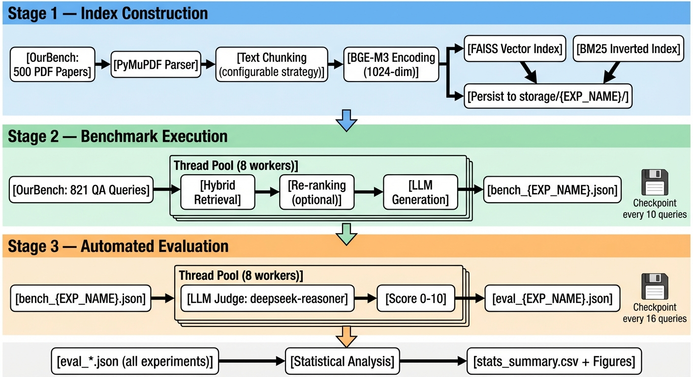
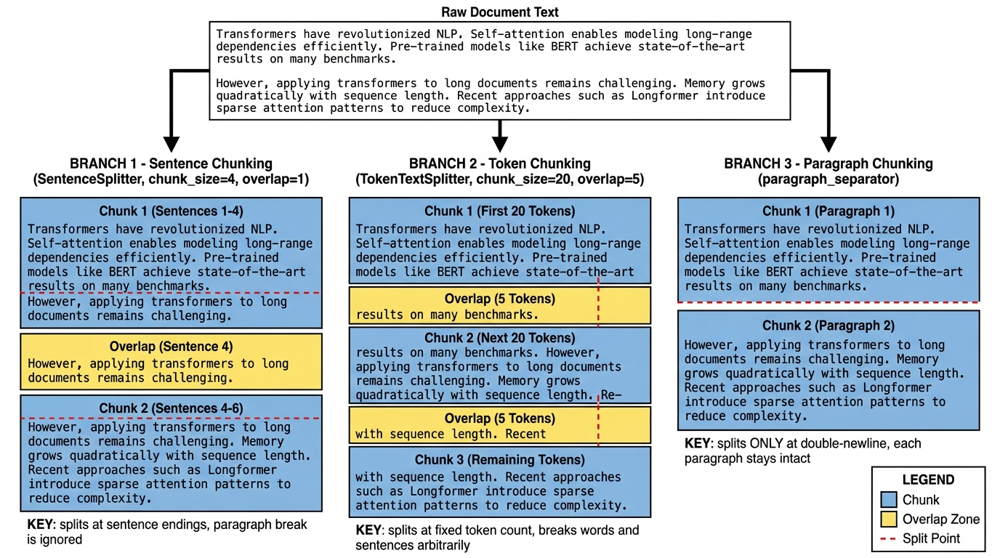
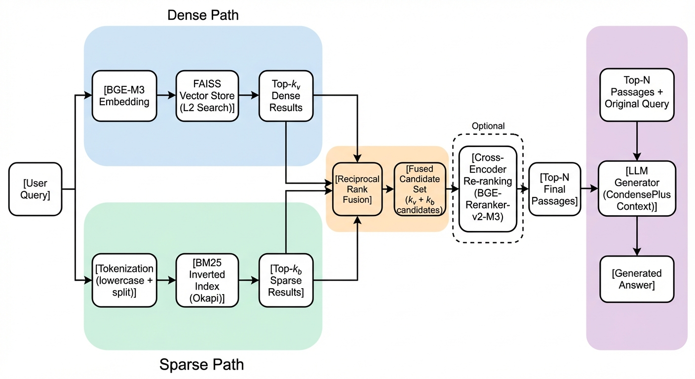
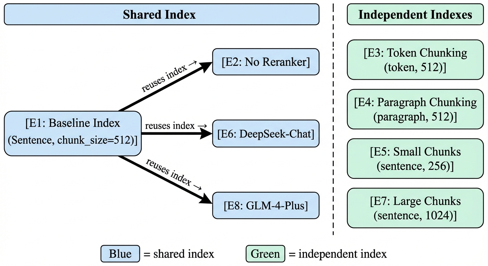

# Methodology

## 1 Overview

This study presents a systematic evaluation framework for Retrieval-Augmented Generation (RAG) systems applied to academic document question answering. We construct a complete RAG pipeline—spanning document ingestion, vector indexing, hybrid retrieval, re-ranking, and LLM-based answer generation—and conduct controlled experiments to investigate the effects of chunking strategies, chunk granularity, re-ranking, and generator model selection on answer quality. The evaluation is performed on **OurBench**, our self-constructed benchmark (detailed in Section 3 of this paper) comprising 500 academic papers and 821 curated QA pairs spanning both extractive and abstractive question types.

Figure 1 presents the overall architecture of our evaluation framework. The system operates as a three-stage pipeline: (1) **Index Construction** — the 500 academic PDFs from OurBench are parsed, chunked under a configurable strategy, and encoded into parallel FAISS vector and BM25 inverted indexes; (2) **Benchmark Execution** — each of the 821 OurBench queries is processed through a hybrid retrieval engine with optional cross-encoder re-ranking, and an LLM generator produces a grounded answer; (3) **Automated Evaluation** — a separate LLM judge (`deepseek-reasoner`) scores every generated answer on a 0–10 scale against the ground-truth reference. All eight experimental configurations pass through this identical pipeline, differing only in the parameter under investigation, and their results are aggregated for statistical comparison.

*Figure 1. Three-stage pipeline execution flow. Stage 1 (blue) constructs FAISS and BM25 indexes from OurBench PDFs. Stage 2 (green) runs multi-threaded benchmark generation with periodic checkpointing. Stage 3 (orange) performs LLM-as-judge evaluation. All experiment results are aggregated for final statistical analysis.*

## 2 RAG Knowledge Base Construction

This section describes the construction of the RAG knowledge base from the OurBench corpus. The benchmark dataset itself—including corpus selection criteria, QA pair generation methodology, and quality filtering—is detailed in Section 3 of this paper; here we focus on how those 500 papers and 821 QA pairs are ingested into the RAG pipeline.

### 2.1 Document Parsing

The 500 academic papers from OurBench are stored as PDF files. We parse all PDFs using **PyMuPDF** (`fitz`) via the LlamaIndex `PyMuPDFReader`, which preserves document structure including page boundaries and per-page metadata (file name, page label). A post-processing step sanitizes all extracted text by replacing invalid UTF-8 surrogate characters to ensure encoding robustness in downstream processing.

### 2.2 Document Chunking

Raw document text is partitioned into overlapping chunks prior to indexing. We investigate three chunking strategies as independent variables:

| Strategy | Splitter | Boundary Heuristic |
|:---------|:---------|:-------------------|
| **Sentence** (default) | `SentenceSplitter` | Splits at sentence boundaries; respects natural linguistic units |
| **Token** | `TokenTextSplitter` | Splits at whitespace/newline boundaries after a fixed token count |
| **Paragraph** | `SentenceSplitter` with `paragraph_separator="\n\n"` | Splits at double-newline paragraph boundaries |

Each strategy is parameterized by **chunk size** (in tokens) and **chunk overlap** (in tokens). The overlap ensures contextual continuity across chunk boundaries.

*Figure 2. Comparison of three chunking strategies applied to the same raw document text. Sentence chunking splits at sentence boundaries and may cross paragraph breaks; token chunking splits at fixed token intervals and may cut mid-sentence; paragraph chunking splits only at double-newline boundaries, keeping each paragraph intact. Yellow regions indicate overlap zones between adjacent chunks.*

### 2.3 Embedding and Vector Indexing

All text chunks are encoded into dense vector representations using **BGE-M3** (`BAAI/bge-m3`), a multilingual embedding model producing 1024-dimensional vectors. The dense index is built on **FAISS** (`IndexFlatL2`) for exact L2 nearest-neighbor search, persisted to disk for reproducibility across experiments.

Simultaneously, a **BM25** inverted index (via `rank_bm25.BM25Okapi`) is constructed over the same chunk corpus, enabling lexical keyword matching. The BM25 retriever operates on whitespace-tokenized, lowercased text.

### 2.4 Hybrid Retrieval

We employ a **hybrid retrieval** strategy that fuses dense semantic search with sparse lexical matching:

1. **Dense Retriever**: Queries the FAISS vector store for the top-$k_v$ semantically similar chunks (default $k_v = 5$).
2. **Sparse Retriever**: Queries the BM25 index for the top-$k_b$ lexically matched chunks (default $k_b = 5$).
3. **Score Fusion**: Results from both retrievers are merged using LlamaIndex's `QueryFusionRetriever`, which performs reciprocal rank fusion over the union of candidates (up to $k_v + k_b$ total).

This hybrid approach mitigates the well-known limitations of purely semantic retrieval (missing exact keyword matches) and purely lexical retrieval (missing semantic paraphrases).

*Figure 3. Hybrid retrieval architecture. The dense path (blue) encodes queries via BGE-M3 for FAISS vector search; the sparse path (green) uses BM25 keyword matching. Results are fused via reciprocal rank fusion (orange), optionally refined by a cross-encoder re-ranker (dashed border), and fed to the LLM generator (purple).*

### 2.5 Cross-Encoder Re-ranking

An optional re-ranking stage refines the fused candidate set using **BGE-Reranker-v2-M3** (`BAAI/bge-reranker-v2-m3`), a cross-encoder model that jointly encodes the query–passage pair to produce a fine-grained relevance score. The re-ranker selects the top-$N$ most relevant passages (default $N = 3$) from the fused candidate pool for final context injection.

### 2.6 Answer Generation

Retrieved passages are injected into a conversational LLM via the **CondensePlusContext** chat engine (LlamaIndex), which:

1. Condenses the conversation history into a standalone query.
2. Retrieves relevant context using the hybrid retriever.
3. Generates a grounded answer using the context-augmented prompt.

Each query is processed with an **independent chat engine instance** (fresh memory buffer, token limit = 3,000) to prevent cross-query context contamination—critical for benchmark reproducibility. The system prompt instructs the model to answer strictly from retrieved content and to explicitly indicate when no relevant information is available.

## 3 Experimental Design

### 3.1 Independent Variables

We design eight controlled experiments to isolate the effect of individual pipeline components. Each experiment modifies exactly one variable from the baseline configuration:

| Exp | Configuration | Independent Variable | Value |
|:----|:-------------|:---------------------|:------|
| **E1** (Baseline) | Sentence chunking, size=512, reranker ON, DeepSeek-Reasoner | — | — |
| **E2** | No Reranker | Re-ranking | `USE_RERANKER=False` |
| **E3** | Token Chunking | Chunking strategy | `CHUNK_STRATEGY="token"` |
| **E4** | Paragraph Chunking | Chunking strategy | `CHUNK_STRATEGY="paragraph"` |
| **E5** | Chunk-256 | Chunk granularity | `CHUNK_SIZE=256` |
| **E6** | DeepSeek-Chat | Generator model | `DEFAULT_MODEL="deepseek-chat"` |
| **E7** | Chunk-1024 | Chunk granularity | `CHUNK_SIZE=1024` |
| **E8** | GLM-4-Plus | Generator model | `DEFAULT_MODEL="glm-4-plus"` |

Additionally, a **No-RAG baseline** is evaluated, where queries are answered directly by `deepseek-chat` without any retrieval context, serving as a lower bound to quantify the value added by the RAG pipeline.

### 3.2 Controlled Variables

To ensure fair comparison, the following variables are held constant across experiments unless they are the explicit independent variable:

| Parameter | Default Value |
|:----------|:-------------|
| Embedding model | `BAAI/bge-m3` (1024-dim) |
| Vector top-$k$ | 5 |
| BM25 top-$k$ | 5 |
| Re-ranker model | `BAAI/bge-reranker-v2-m3` |
| Re-rank top-$N$ | 3 |
| Chunk overlap | 50 tokens |
| Chat memory token limit | 3,000 |
| Evaluation judge | `deepseek-reasoner` |
| Benchmark dataset | OurBench (821 QA pairs, identical set for all experiments) |

Experiments that share the same chunking configuration (E2, E6, E8) **reuse the baseline index** (`INDEX_SOURCE_EXP="baseline"`) to eliminate indexing variance and reduce computation.

### 3.3 Index Reuse Strategy

To ensure that observed differences are attributable solely to the varied parameter and not to indexing randomness, experiments that differ only in retrieval or generation settings reuse a pre-built index:

*Figure 4. Index reuse strategy across experiments. E2, E6, and E8 (blue) share the baseline FAISS/BM25 index, isolating the effect of their respective independent variables. E3, E4, E5, and E7 (green) each build independent indexes due to differing chunking configurations.*

## 4 Evaluation Methodology

### 4.1 Evaluation Dataset

All experiments are evaluated on the same **821 QA pairs** from OurBench. Each query is linked to a specific source paper via `qrels_filtered.json` (document ID and section ID), and is annotated with a question type: **extractive** (520 queries, 63.3%) or **abstractive** (301 queries, 36.7%). Ground-truth answers are provided in `answers_filtered.json`. The construction process of OurBench—including paper selection, QA generation, filtering criteria, and quality assurance—is described in detail in Section 3 of this paper.

### 4.2 LLM-as-Judge Scoring

Each generated answer is evaluated by an **LLM judge** (`deepseek-reasoner`) that assigns an integer score from 0 to 10 by comparing the RAG-generated answer against the ground-truth reference. The judge receives a structured prompt containing the query, ground truth, and generated answer, and is instructed to return only a numeric score. The score is extracted via regex pattern matching (`\b(10|[0-9])\b`).

This approach follows the LLM-as-judge paradigm validated in recent literature (Zheng et al., 2023), offering scalable evaluation that correlates well with human judgment for factual QA tasks.

### 4.3 Statistical Testing

We employ a rigorous statistical framework to assess the significance of performance differences:

| Method | Purpose |
|:-------|:--------|
| **Wilcoxon Signed-Rank Test** | Non-parametric paired test comparing each experiment's score distribution against the baseline on the same query set |
| **Bootstrap 95% Confidence Intervals** | Percentile bootstrap (5,000 resamples) for mean score estimation |
| **Cohen's *d*** | Standardized effect size measuring practical significance |
| **Win/Tie/Loss Analysis** | Per-query head-to-head comparison against baseline |
| **Mann-Whitney U Test** | Pairwise all-vs-all comparison matrix |

Significance levels are reported as: \*\*\* ($p < 0.001$), \*\* ($p < 0.01$), \* ($p < 0.05$), ns (not significant).

### 4.4 Stratified Analysis

All metrics are computed both **overall** and **stratified by query type** (extractive vs. abstractive), enabling differential analysis of how pipeline components affect information extraction versus reasoning-intensive tasks.
